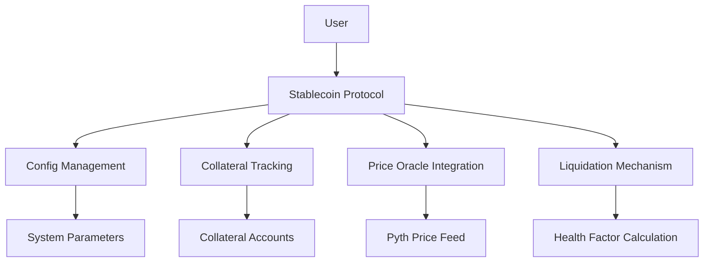
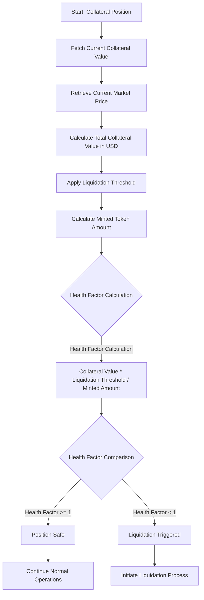
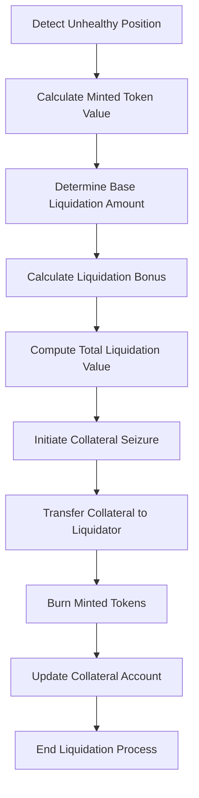
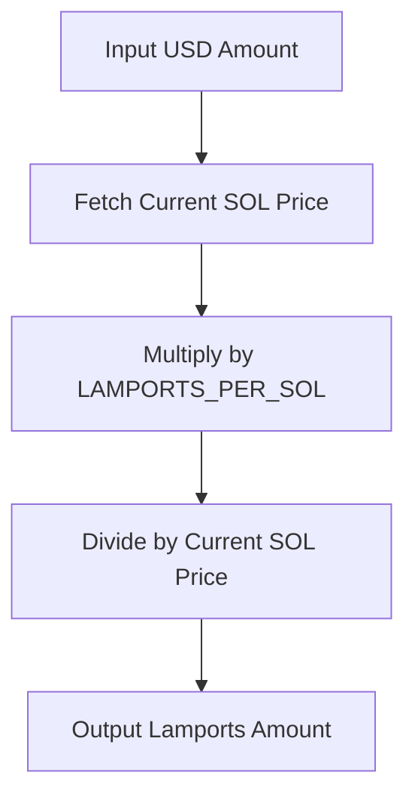
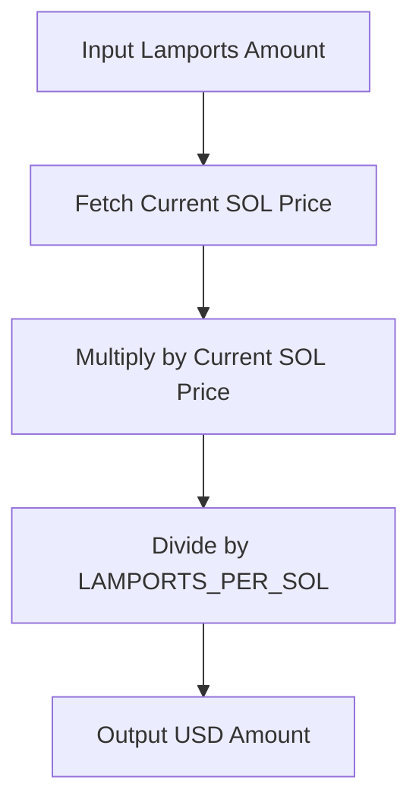
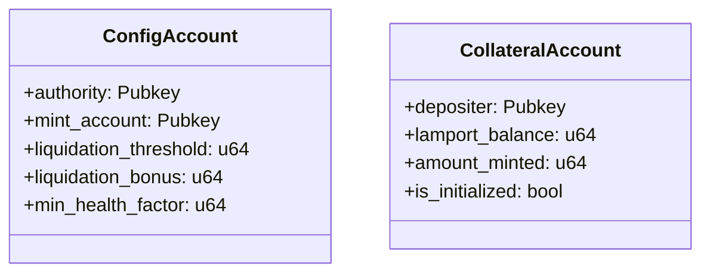

# Stablecoin

## Overview
A decentralized stablecoin protocol built on Solana, providing a robust mechanism for collateralized token minting with advanced risk management and liquidation strategies.

## System Architecture


## Key Features
- Collateralized Stablecoin Minting
- Dynamic Health Factor Calculation
- Advanced Liquidation Mechanism
- Pyth Network Price Oracle Integration
- Secure Solana Program Architecture

## Detailed Calculations

### 1. Health Factor Calculation

#### Flowchart of Health Factor Determination


#### Purpose
The health factor is a critical risk metric that determines the stability of a user's collateralized position. It ensures that the value of collateral adequately covers the minted stablecoins.

#### Mathematical Formulation
```
Health Factor = (Collateral Value * Liquidation Threshold) / Minted Amount
```

#### Detailed Breakdown
- **Collateral Value**:
  - Calculated by multiplying the collateral amount by its current market price
  - Obtained through real-time price feeds from Pyth Network
  - Represents the total USD value of locked collateral

- **Liquidation Threshold**:
  - A predefined percentage (typically 50-80%)
  - Represents the maximum percentage of collateral value that can be used for minting
  - Provides a safety buffer to protect against market volatility

- **Minted Amount**:
  - Total number of stablecoins issued against the collateral
  - Directly impacts the health of the position

### 2. Liquidation Calculation

#### Liquidation Process Flowchart


#### Purpose
Liquidation mechanism protects the protocol from under-collateralized positions by allowing liquidators to seize and sell collateral.

#### Mathematical Formulation
```
Liquidation Base Amount = Minted Token Amount * Current Price
Liquidation Bonus = Liquidation Base Amount * Bonus Percentage
Total Liquidation Value = Base Amount + Liquidation Bonus
```

#### Detailed Breakdown
- **Minted Token Amount**:
  - Converted to USD using current market price
  - Determines the base liquidation value

- **Liquidation Bonus**:
  - Incentive percentage for liquidators
  - Typically 5-10% of the liquidation value
  - Encourages prompt identification and resolution of risky positions

### 3. Price Conversion Calculations

#### USD to Lamports Conversion Flowchart


#### Lamports to USD Conversion Flowchart


#### Conversion Formulas
```
Lamports = (USD Amount * LAMPORTS_PER_SOL) / Current SOL Price
USD Value = (Lamports * Current SOL Price) / LAMPORTS_PER_SOL
```

#### Key Considerations
- Uses Pyth Network's real-time price feeds
- Accounts for decimal precision
- Handles potential price volatility

## Technical Components

### Rust Module Structure
- `config.rs`: System configuration management
- `collateral.rs`: User collateral tracking
- `utils.rs`: Utility functions for price conversion
- `instructions/`: Core program logic modules

### Key Data Structures


## Security Considerations
- Dynamic health factor calculation
- Robust liquidation mechanism
- Pyth oracle price validation
- Strict collateralization requirements

## License
MIT License


