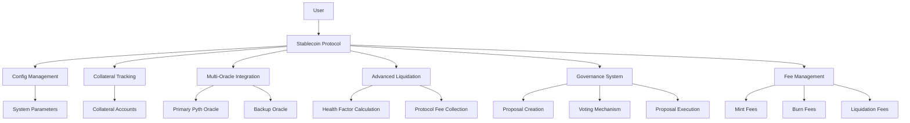
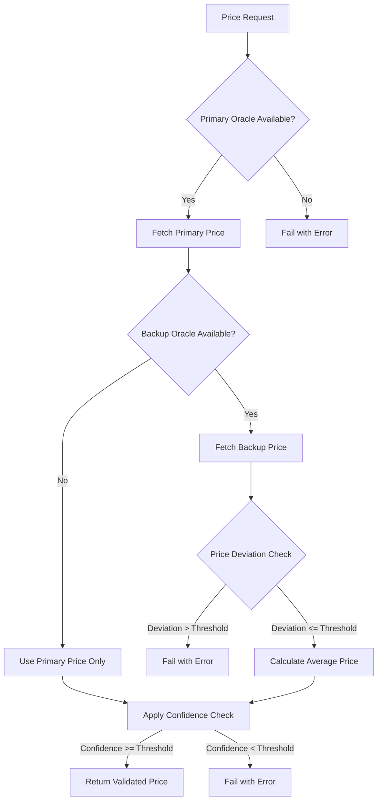
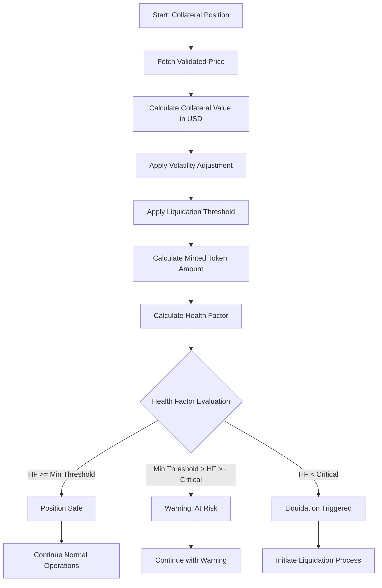
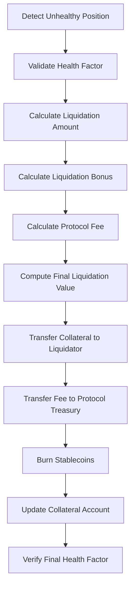
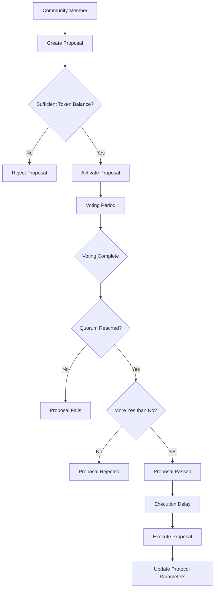
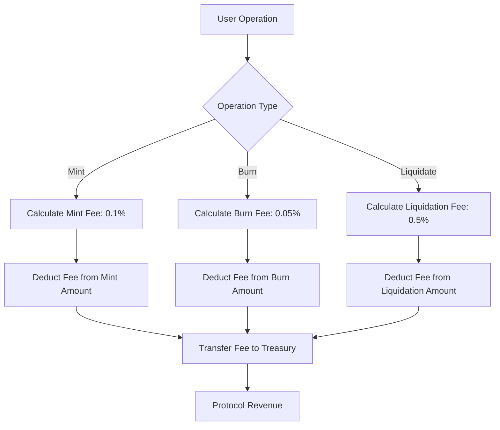
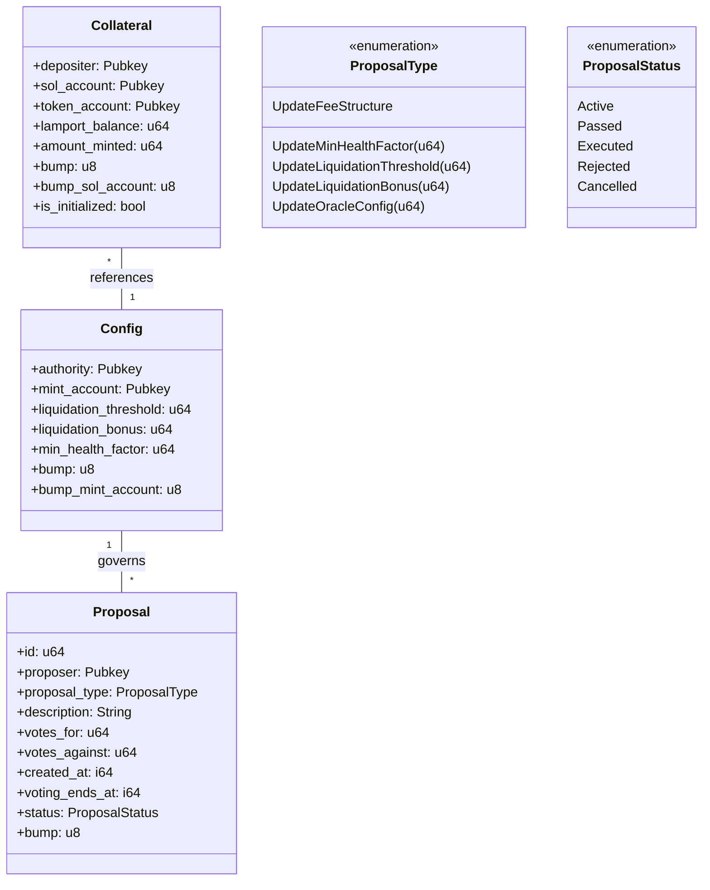

# Stablecoin Protocol

## Overview
A decentralized stablecoin protocol built on Solana, providing a robust mechanism for collateralized token minting with advanced risk management, multi-oracle price feeds, governance capabilities, and sophisticated liquidation strategies.

## System Architecture


## Key Features

### Core Features
- Collateralized Stablecoin Minting
- Dynamic Health Factor Calculation
- Advanced Liquidation Mechanism
- Multi-Oracle Price Feed Integration
- Secure Solana Program Architecture

### Enhanced Features
- **Multi-Oracle Support**: Redundant price feeds with deviation checks
- **Advanced Risk Management**: Volatility adjustments and collateralization limits
- **Decentralized Governance**: Community-driven parameter adjustments
- **Fee Structure**: Revenue generation through mint, burn, and liquidation fees
- **Improved Security**: Enhanced validation and error handling

## Detailed Mechanisms

### 1. Multi-Oracle Price Validation



#### Key Improvements
- **Redundancy**: Multiple price oracles for increased reliability
- **Deviation Checks**: Ensures price consistency across sources
- **Confidence Validation**: Requires high confidence in price data
- **Fallback Mechanism**: Graceful handling when one oracle is unavailable

### 2. Enhanced Health Factor Calculation



#### Mathematical Formulation
```
Adjusted Collateral Value = Collateral Value * (1 - Volatility Adjustment)
Health Factor = (Adjusted Collateral Value * Liquidation Threshold) / Minted Amount
```

### 3. Advanced Liquidation Mechanism



#### Mathematical Formulation
```
Liquidation Base Amount = Stablecoin Amount * Current Price
Liquidation Bonus = Base Amount * Bonus Percentage
Protocol Fee = Base Amount * Fee Percentage
Final Liquidation Value = Base Amount + Bonus - Fee
```

### 4. Governance System



#### Governance Parameters
- **Proposal Threshold**: 100,000 tokens
- **Voting Period**: 24 hours
- **Execution Delay**: 12 hours
- **Quorum Requirement**: 10% of total supply

### 5. Fee Structure



## Technical Components

### Enhanced Rust Module Structure
- `state.rs`: Core data structures
- `constants.rs`: System configuration constants
- `error.rs`: Comprehensive error handling
- `instructions/`: Core program logic modules
  - `deposit/`: Collateral deposit and token minting
  - `withdraw/`: Collateral redemption and token burning
  - `admin/`: Administrative functions
  - `governance/`: Decentralized governance system
- `utils.rs`: Enhanced utility functions with multi-oracle support

### Key Data Structures



## Security Enhancements

- **Multi-Oracle Validation**: Prevents oracle manipulation attacks
- **Volatility Adjustment**: Accounts for market volatility in collateral valuation
- **Collateralization Limits**: Prevents both under and over-collateralization
- **Enhanced Error Handling**: Comprehensive error types with descriptive messages
- **Fee Collection**: Sustainable protocol revenue generation
- **Governance Timelock**: Prevents rushed or malicious parameter changes

## Protocol Parameters

| Parameter | Value | Description |
|-----------|-------|-------------|
| Liquidation Threshold | 50% | Maximum percentage of collateral that can be borrowed against |
| Liquidation Bonus | 10% | Incentive for liquidators |
| Min Health Factor | 1.0 | Minimum required health factor before liquidation |
| Critical Health Factor | 2.0 | Warning threshold for at-risk positions |
| Min Collateral Ratio | 150% | Minimum required collateralization |
| Max Collateral Ratio | 300% | Maximum recommended collateralization |
| Volatility Adjustment | 5% | Safety discount applied to collateral value |
| Mint Fee | 0.1% | Fee charged on minting operations |
| Burn Fee | 0.05% | Fee charged on burning operations |
| Liquidation Fee | 0.5% | Fee charged on liquidations |

## License
MIT License